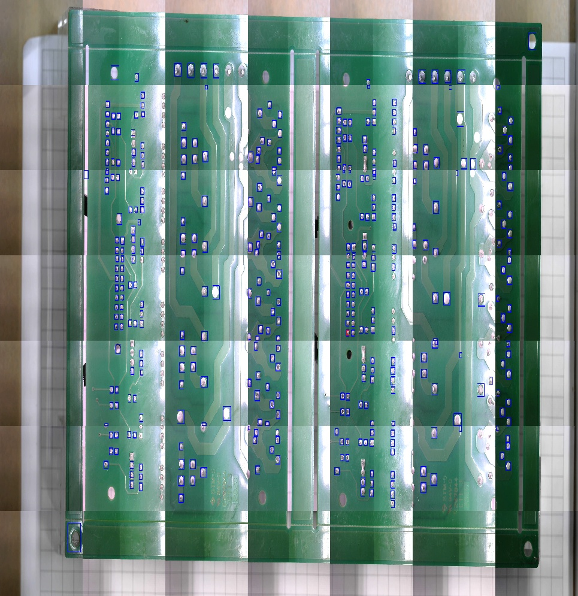

# AOI
## Automatic Optical Inspection for PCB Soldering

The main target of this software is to Inspect for defects in through-hole Printed Circuit Boards (PCB), which are assembled using automated soldering lines.

**This software includes the following features,**

1.Visual Inspection using MaskRCNN Deep Learning Algorithm.

2.QT Based graphical interface to interact with the system

3.Serial communication with an external embedded controller to control the position of the camera

4.Multi-threading implementation to reduce the time inspection process.

**This project is built from scartch and QT Creator is used to design the interface of the software**

## Results

The final results of the inspection process shown as below,

